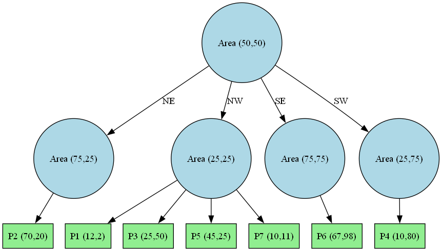

# Proyecto Final: Estructura **Quadtree**

---

## Integrantes

- **Alexander Antonio Astorga Taccsi**
- **Sebastian Ignacio Samanez Quintana**
- **Gonzalo Alejandro Rodriguez Galarza**

---

## Descripción del Proyecto

Este proyecto implementa una estructura de datos **Quadtree** utilizando el lenguaje C++. Un Quadtree es útil para dividir recursivamente un espacio bidimensional en cuatro cuadrantes o regiones, lo que facilita el manejo eficiente de datos espaciales como puntos o coordenadas.

El objetivo principal es organizar puntos en un plano 2D y generar su representación gráfica mediante un archivo `.dot`, el cual puede visualizarse con la herramienta Graphviz.

---

## Visualización

La siguiente imagen representa gráficamente el resultado del Quadtree luego de insertar varios puntos:

La siguiente imagen representa gráficamente el resultado del Quadtree luego de eliminar un punto:

---
